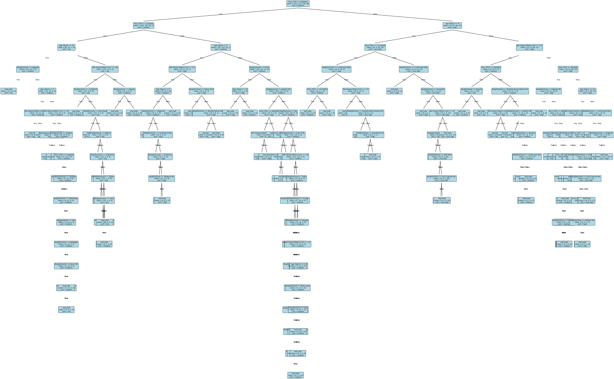

# Decision Tree & Random Forest

This project implements a **Decision Tree classifier and a Random Forest model from scratch using Python and NumPy**, without using machine learning libraries such as scikit-learn.

The implementation includes:

* Decision Tree training using **Gini impurity**
* Support for **categorical and numerical features**
* Random Forest using **random feature subspace**
* Tree visualization using **Matplotlib**
* Model evaluation using multiple classification metrics

---

# Dataset

The dataset contains information about housing properties.

### Features

* **Neighborhood** (categorical)
* **Price (TRY)** (numerical)
* **Age (Years)** (numerical)
* **Net Square Meters (m²)** (numerical)

### Target Classes

The model predicts the property value category:

* low
* medium
* high
* very high

---

# Decision Tree Visualization

Below is the fully grown decision tree generated after training.

---

# Model Performance

## Decision Tree

### Train Results

| Metric           | Value |
| ---------------- | ----- |
| Accuracy         | 1.000 |
| Recall (TP Rate) | 1.000 |
| TN Rate          | 1.000 |
| Precision        | 1.000 |
| F-Score          | 1.000 |
| Total TP         | 501   |
| Total TN         | 1503  |

The perfect performance on the training data indicates that the tree **fully memorizes the training dataset**, which is typical for an unpruned decision tree.

---

### Test Results

| Metric           | Value |
| ---------------- | ----- |
| Accuracy         | 0.786 |
| Recall (TP Rate) | 0.781 |
| TN Rate          | 0.922 |
| Precision        | 0.787 |
| F-Score          | 0.784 |
| Total TP         | 99    |
| Total TN         | 351   |

The drop in performance between training and test results indicates **overfitting**, which is expected for a fully grown decision tree.

---

## Random Forest Results

| Metric           | Value |
| ---------------- | ----- |
| Accuracy         | 0.659 |
| Recall (TP Rate) | 0.607 |
| TN Rate          | 0.872 |
| Precision        | 0.684 |
| F-Score          | 0.629 |
| Total TP         | 83    |
| Total TN         | 335   |

The Random Forest model was trained using **15 trees and random feature subsets**.

Because each tree uses only a subset of features (`feature_size = 2`), the model performance is lower than the single decision tree in this experiment.

---

# The script will:

* Train the decision tree
* Evaluate train and test performance
* Train a random forest model
* Generate the decision tree visualization

---

# Implementation Details

Key algorithms implemented manually:

* Gini impurity calculation
* Best split search
* Recursive tree construction
* Tree traversal for prediction
* Random Forest using random feature subsets
* Evaluation metrics calculation:

  * Accuracy
  * Recall
  * TN Rate
  * Precision
  * F-Score

---

# Technologies Used

* Python
* NumPy
* Pandas
* Matplotlib

